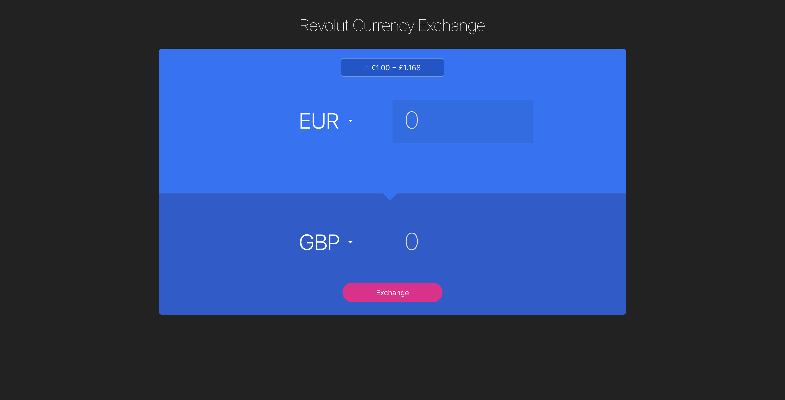

<h1 align="center">
  	   Currency Exchange
</h1>

### Revolut Currency Exchange

A React and Redux app using [Create React App](https://github.com/facebook/create-react-app) to replicate the functionality of Revolut Android's app (Exchange activity).

Uses [exchangeratesapi.io](https://api.exchangeratesapi.io/latest) to fetch the latest FX rates every 10 seconds.

### Project Building:

In the project directory, follow below steps to run:

### `npm install`

- Clone or download `https://github.com/rinki-ku/currency-exchange`
- Run `npm install`

### `npm start`

Runs the app in the development mode. 
Open [http://localhost:3000](http://localhost:3000) to view it in the browser.

The page will reload if you make edits. 
You will also see any lint errors in the console.

### `npm test`

Launches the test runner in the interactive watch mode. 

### `npm run build`

Builds the app for production to the `build` folder. 
It correctly bundles React in production mode and optimizes the build for the best performance.

The build is minified and the filenames include the hashes. 
Your app is ready to be deployed!

## Technologies used

- React
- Redux
- Axios
- Sass
